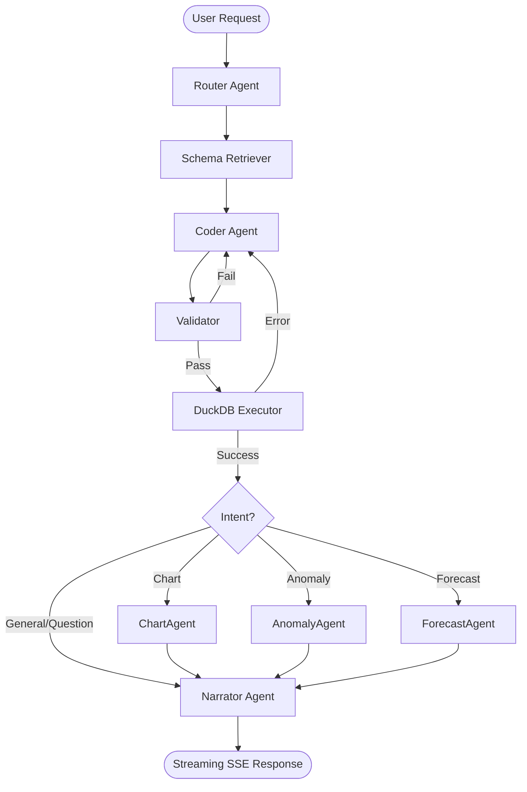

# AI-Powered Data Analyst

An autonomous, multi-agent pipeline built with **LangGraph** and **Google Gemini** that allows users to upload CSV datasets, ask questions in plain English, and receive insights, charts, and forecasts.

## 🌟 Key Features

- **Multi-Agent Architecture**: Requests are intelligently routed between specialized agents (Coder, Validator, Executor, Chart, Anomaly, Forecast, and Narrator).
- **Secure by Design**: Formula injection escape, prompt injection quarantine, and AST-level query validation (`sqlglot` + pandas allowlists).
- **Interactive Data Viz**: Auto-generated Plotly JSON charts rendered dynamically in the UI.
- **Robust UI/UX**: Built with React, Vite, and GSAP for fluid, modern micro-animations.
- **Eval-Ready**: Includes a standalone script (`eval/run_eval.py`) that uses an LLM-as-a-judge to grade pipeline accuracy.
- **PDF Export**: Generate beautiful HTML-to-PDF reports of your conversation history using WeasyPrint.

## 🏗️ Architecture



## 🚀 Getting Started

### Prerequisites
- Python 3.11+
- Node.js 18+
- Docker & Docker Compose
- Google Gemini API Key

### 1. Environment Setup

Copy the environment template and add your API keys:
```bash
cp .env.example .env
```

Ensure `.env` contains:
```env
GEMINI_API_KEY=your_gemini_api_key_here
```

### 2. Boot Services (Database & Cache)

The backend relies on PostgreSQL (for users) and Redis (for rate-limiting/caching):
```bash
docker-compose up -d postgres redis
```

### 3. Start the Backend

```bash
cd backend
python -m venv venv
source venv/bin/activate  # On Windows: venv\Scripts\activate
pip install -r requirements.txt

# Start FastAPI server
uvicorn app.main:app --reload --port 8000
```

### 4. Start the Frontend

In a new terminal:
```bash
cd frontend
npm install
npm run dev
```

Visit `http://localhost:5173` to access the application.

## 🧪 Evaluation Framework

To run the automated LLM-as-a-judge test suite:
```bash
export PYTHONPATH=.
python eval/run_eval.py
```
This tests the LangGraph pipeline against a synthetic test set (`eval/test_set.json`) and outputs a detailed `eval_report.json`.

## 📦 Deployment

### Frontend (Vercel)
The `frontend/` directory contains a `vercel.json` configured for SPA routing. You can deploy it directly via the Vercel CLI or by connecting your GitHub repo.

### Backend (Railway / Fly.io)
A `Procfile` is included at the root directory. Configure your host to run `uvicorn backend.app.main:app --host 0.0.0.0 --port $PORT` (as defined in the Procfile). Ensure you provision a PostgreSQL and Redis instance and inject their URLs as environment variables.
