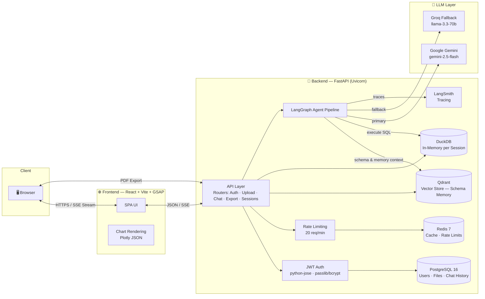
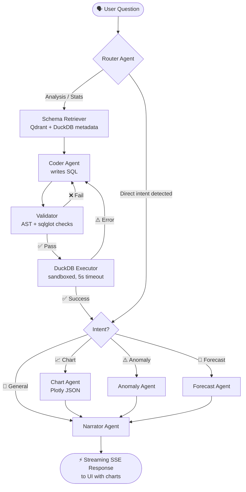

<p align="center">
  " alt="askQL Logo" width="180" />
</p>

<h1 align="center">🛸 askQL — AI Data Analyst</h1>

<p align="center">
  <b>Ask questions in plain English. Get insights, charts & forecasts — instantly.</b><br/>
  An autonomous, multi-agent data-analysis pipeline built on <b>LangGraph</b>, <b>Google Gemini</b> & <b>DuckDB</b>.
</p>

<p align="center">
  <a href="https://drive.google.com/file/d/127ZE1zw5DRSMm6VBHzC36NH1_O6hMKv3/view?usp=sharing"><b>▶ &nbsp;Watch the Demo Video</b></a>
</p>

<p align="center">
  <a href="https://python.org"></a>
  <a href="https://fastapi.tiangolo.com"></a>
  <a href="https://react.dev"></a>
  <a href="https://www.langchain.com/langgraph"></a>
  <a href="https://duckdb.org"></a>
  <a href="https://qdrant.tech"></a>
  <a href="https://redis.io"></a>
  <a href="https://www.postgresql.org"></a>
  <a href="https://www.docker.com"></a>
  <a href="https://vercel.com"></a>
  <a href="https://render.com"></a>
</p>

<hr/>

## 📺 Demo

Upload a CSV, ask something like *"What are the top 5 products by revenue?"* and watch the pipeline route your question through specialized agents — generating SQL, executing it against an in-memory DuckDB, and streaming a narrated answer with charts.

<p align="center">
  <a href="https://drive.google.com/file/d/127ZE1zw5DRSMm6VBHzC36NH1_O6hMKv3/view?usp=sharing">
    
  </a>
</p>

---

## ✨ Key Features

| | Feature | Description |
|---|---|---|
| 🤖 | **Multi-Agent Pipeline** | Requests routed between specialized agents — Router, Coder, Validator, Executor, Chart, Anomaly, Forecast & Narrator. |
| 🧠 | **Gemini + Groq Fallback** | Primary LLM is Gemini 2.5 Flash; automatic fallback to Groq (Llama 3.3 70B) for resilience. |
| 🔒 | **Secure by Design** | Formula-injection escape, prompt-injection quarantine, AST-level SQL validation (`sqlglot` + pandas allowlists). |
| 📊 | **Interactive Data Viz** | Auto-generated Plotly JSON charts rendered dynamically in the React UI. |
| ⚡ | **Streaming Responses** | Token-by-token narration via SSE (`sse-starlette`). |
| 🧵 | **Isolated Execution** | Each session gets its own in-memory DuckDB instance — zero cross-tenant leakage. |
| 🧠 | **Conversation Memory** | Session-scoped multi-turn context (last 20 turns) for coherent follow-ups. |
| 🔍 | **Schema Retrieval** | Column-level relevance scoring so the LLM only sees schema it actually needs. |
| 📄 | **PDF Export** | One-click HTML→PDF reports of the conversation (WeasyPrint). |
| 🧪 | **Eval-Ready** | LLM-as-a-judge grading of pipeline accuracy against a synthetic test set. |
| 🎨 | **Fluid UI** | React + Vite + GSAP micro-animations, modern dark theme, keyboard-friendly. |

---

## 🏗️ Architecture

### System Overview



### Agent Pipeline (LangGraph)



---

## 🧰 Tech Stack

| Layer | Technology |
|---|---|
| **Frontend** | React 18, Vite, GSAP, Plotly |
| **API** | FastAPI, Uvicorn, SSE (`sse-starlette`) |
| **Agents** | LangGraph, LangChain, LangChain Google GenAI |
| **LLMs** | Google Gemini 2.5 Flash, Groq Llama 3.3 70B (fallback) |
| **Analytics Engine** | DuckDB (in-memory, per session), pandas, sqlglot |
| **Vector Store** | Qdrant |
| **Cache & Rate Limits** | Redis |
| **Database** | PostgreSQL 16 (SQLAlchemy async + asyncpg) |
| **Auth** | JWT (python-jose), bcrypt (passlib) |
| **Observability** | LangSmith, structlog |
| **Infra** | Docker Compose, Render (backend), Vercel (frontend) |

---

## 📁 Project Structure

```
askql/
├── backend/                  # FastAPI application
│   ├── app/
│   │   ├── agents/           # LangGraph agent pipeline
│   │   │   ├── graph.py          # Graph assembly & orchestration
│   │   │   ├── router_agent.py   # Intent routing
│   │   │   ├── coder_agent.py    # SQL generation
│   │   │   ├── validator.py      # AST/sqlglot validation
│   │   │   ├── executor.py       # DuckDB sandboxed execution
│   │   │   ├── chart_agent.py    # Plotly chart generation
│   │   │   ├── anomaly_agent.py  # Anomaly detection
│   │   │   ├── forecast_agent.py # Time-series forecasting
│   │   │   ├── narrator_agent.py # Natural-language narration
│   │   │   ├── schema_retriever.py
│   │   │   └── memory.py         # Session conversation memory
│   │   ├── models/           # SQLAlchemy models (users, files, chats)
│   │   ├── routers/          # Auth, Upload, Chat, Export, Sessions
│   │   ├── security/         # JWT + password hashing
│   │   ├── services/         # duckdb, qdrant, redis, llm services
│   │   ├── config.py         # Pydantic settings (env-driven)
│   │   └── main.py           # FastAPI app + lifespan
│   ├── requirements.txt
│   └── Dockerfile
├── frontend/                 # React + Vite + GSAP SPA
├── eval/                     # LLM-as-a-judge evaluation suite
├── data/                     # Runtime data volume
├── logo/                     # Branding assets
├── docker-compose.yml        # Backend + Frontend + Postgres + Redis + Qdrant
├── Procfile                  # uvicorn backend.app.main:app
├── render.yaml               # Render blueprint (backend)
└── .env.example              # Environment template
```

---

## 🚀 Getting Started

### Prerequisites

- Python 3.11+
- Node.js 18+
- Docker & Docker Compose
- A [Google Gemini API key](https://aistudio.google.com/app/apikey) (Groq key optional for fallback)

### 1. Environment Setup

```bash
cp .env.example .env
# then edit .env and add your keys
```

### 2. Boot Infra Services (Postgres + Redis + Qdrant)

```bash
docker-compose up -d postgres redis qdrant
```

### 3. Run the Backend

```bash
cd backend
python -m venv venv
source venv/bin/activate      # Windows: venv\Scripts\activate
pip install -r requirements.txt

uvicorn app.main:app --reload --port 8000
# → http://localhost:8000/docs  (interactive Swagger UI)
```

### 4. Run the Frontend

```bash
cd frontend
npm install
npm run dev
# → http://localhost:5173
```

> 💡 **Or run everything at once:** `docker-compose up --build` boots the full stack (API, frontend, Postgres, Redis, Qdrant).

---

## 🔐 Environment Variables

| Variable | Default | Required | Purpose |
|---|---|---|---|
| `GEMINI_API_KEY` | — | ✅ | Primary LLM (Gemini) |
| `GROQ_API_KEY` | *(empty)* | ❌ | Fallback LLM |
| `DATABASE_URL` | localhost | ✅* | PostgreSQL connection (`postgresql+asyncpg://…`) |
| `REDIS_URL` | localhost | ✅* | Redis cache & rate limiting |
| `QDRANT_URL` | localhost | ✅* | Vector store for schema memory |
| `JWT_SECRET` | `super-secret-change-me` | ✅ | Token signing — change it! |
| `BACKEND_CORS_ORIGINS` | `http://localhost:5173` | ✅ | Comma-separated allowed origins |
| `LANGCHAIN_API_KEY` | *(empty)* | ❌ | LangSmith tracing |
| `LLM_MODEL` | `gemini-2.5-flash` | ❌ | Primary model id |
| `MAX_FILE_SIZE_MB` / `MAX_ROWS` / `MAX_COLUMNS` | 25 / 100k / 200 | ❌ | Upload guardrails |

*\* Required for the features that use them; the API will still boot if omitted (Qdrant/Redis default to in-memory fallbacks).*

---

## 🧪 Evaluation Framework

Grade the pipeline's accuracy with an LLM-as-a-judge:

```bash
export PYTHONPATH=.
python eval/run_eval.py
```

Runs the LangGraph pipeline against the synthetic test set (`eval/test_set.json`) and emits a detailed `eval_report.json`.

---

## 📦 Deployment

### Backend — Render

A [Render blueprint](render.yaml) is included. Push to GitHub, then **New → Blueprint** in Render, and set these env vars on the service:

- `GEMINI_API_KEY`, `DATABASE_URL` (create a Render PostgreSQL), `REDIS_URL`, `QDRANT_URL`, `JWT_SECRET`, `BACKEND_CORS_ORIGINS`

**Known deploy gotchas:**
- Pin **Python 3.12** (`pythonVersion` is already set in `render.yaml`) — 3.14 has no prebuilt wheels for duckdb/pandas/asyncpg and OOMs the build.
- The service listens on `$PORT` (see `Procfile`).

### Frontend — Vercel

```bash
cd frontend
npm i -g vercel && vercel
```

`vercel.json` handles SPA routing; connect the repo for auto-deploys on push.

---

## 🛣️ Roadmap

- [x] Multi-agent LangGraph pipeline with validation & sandboxed execution
- [x] SSE streaming, charts, anomaly detection, forecasting
- [x] Auth (JWT), sessions, PDF export, evaluation harness
- [ ] Fully-wired Qdrant embedding retrieval (currently in-memory relevance scoring)
- [ ] LangGraph checkpoint persistence to Postgres
- [ ] Multi-user workspaces & dataset sharing
- [ ] Voice queries & natural-language dashboard builder

---

<p align="center">
  Built with ❤️ using LangGraph, FastAPI, React & DuckDB<br/>
  <sub>askQL — ask anything, get answers.</sub>
</p>
