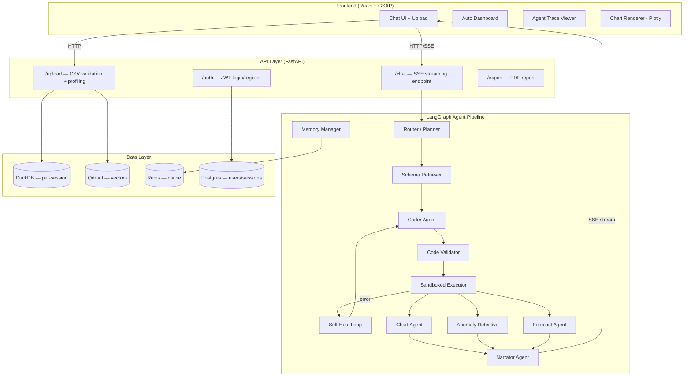

# AI-Powered Data Analyst — Implementation Plan

> Built against the [PRD](file:///d:/Code/internship/assignment/PRD_AI_Data_Analyst.md). Stack: **FastAPI · LangGraph · DuckDB · React · GSAP · Qdrant · Redis · Postgres · Docker**

---

## User Review Required

> [!IMPORTANT]
> **LLM Provider**: The PRD specifies Claude (Anthropic API) for all agent nodes. Confirm this is the intended provider, or if you'd prefer OpenAI / Gemini as the backbone (affects `langchain` adapter choice and cost).

> [!IMPORTANT]
> **Tailwind**: The PRD mentions Tailwind in the stack. You asked for a light YC-backed look — I'll use **vanilla CSS with CSS custom properties** (per workspace conventions) unless you explicitly want Tailwind. Please confirm.

> [!WARNING]
> **Free-tier LLM budget**: Claude API has no permanent free tier. You'll need an Anthropic API key with credits. The eval framework (15–20 automated queries) and anomaly detective (up to 10 LLM calls per anomaly scan) will consume tokens fast during development. Consider caching aggressively from day one.

## Open Questions

1. **Auth flow**: The PRD lists JWT auth. Do you want a full signup/login UI, or is a simple API-key–gated demo sufficient for the internship submission?
2. **Sample dataset**: Should I generate the synthetic sales CSV (region, product, customer, date, revenue, quantity) as part of this build, or do you have one ready?
3. **Deployment target**: PRD suggests Railway/Fly.io for backend + Vercel for frontend. Any preference, or should I pick the path of least friction?
4. **OCR ingestion**: It was listed as P2 and removed from standout features — confirm it's fully cut from scope.

---

## Proposed Architecture



---

## Proposed Changes

### Phase 1 — Project Scaffolding & Foundation

#### [NEW] Monorepo Structure

```
d:\Code\internship\assignment\
├── backend/
│   ├── app/
│   │   ├── main.py              # FastAPI entry, CORS, lifespan
│   │   ├── config.py            # Pydantic settings, env vars
│   │   ├── routers/
│   │   │   ├── upload.py        # CSV upload + validation
│   │   │   ├── chat.py          # SSE chat endpoint
│   │   │   ├── auth.py          # JWT auth
│   │   │   └── export.py        # PDF export
│   │   ├── agents/
│   │   │   ├── graph.py         # LangGraph graph definition
│   │   │   ├── router_agent.py  # Intent classification
│   │   │   ├── schema_retriever.py
│   │   │   ├── coder_agent.py   # SQL/pandas generation
│   │   │   ├── validator.py     # AST-based code validation
│   │   │   ├── executor.py      # Sandboxed execution
│   │   │   ├── chart_agent.py   # Plotly spec generation
│   │   │   ├── anomaly_agent.py # Statistical + LLM detective
│   │   │   ├── forecast_agent.py
│   │   │   ├── narrator_agent.py
│   │   │   └── memory.py        # Session state / checkpointing
│   │   ├── services/
│   │   │   ├── duckdb_service.py # Per-session DuckDB management
│   │   │   ├── qdrant_service.py # Embedding + retrieval
│   │   │   ├── redis_service.py  # Caching layer
│   │   │   └── sandbox.py        # Code execution sandbox
│   │   ├── security/
│   │   │   ├── csv_sanitizer.py  # Formula injection, prompt injection
│   │   │   ├── code_validator.py # AST allowlist checker
│   │   │   └── rate_limiter.py   # Redis token bucket
│   │   └── models/
│   │       ├── schemas.py        # Pydantic request/response models
│   │       └── db_models.py      # SQLAlchemy/Postgres models
│   ├── requirements.txt
│   ├── Dockerfile
│   └── .env.example
├── frontend/
│   ├── src/
│   │   ├── main.jsx
│   │   ├── App.jsx
│   │   ├── index.css            # Design system (CSS custom props)
│   │   ├── animations/
│   │   │   ├── gsap-registry.js # Central GSAP plugin registration
│   │   │   ├── transitions.js   # Page/route transitions
│   │   │   ├── scroll.js        # ScrollTrigger animations
│   │   │   └── micro.js         # Hover, stagger, counters
│   │   ├── components/
│   │   │   ├── layout/          # Navbar, Sidebar, PageShell
│   │   │   ├── upload/          # Dropzone, FileCard, ProgressBar
│   │   │   ├── chat/            # ChatPanel, MessageBubble, StreamingText
│   │   │   ├── charts/          # ChartRenderer (Plotly wrapper)
│   │   │   ├── dashboard/       # AutoDashboard, StatCard, QualityReport
│   │   │   ├── trace/           # AgentTraceTimeline, StepCard
│   │   │   ├── anomaly/         # AnomalyCard, DetectiveNote
│   │   │   └── common/          # Button, Badge, Modal, Tooltip
│   │   ├── hooks/
│   │   │   ├── useSSE.js        # SSE stream consumer
│   │   │   ├── useGsap.js       # GSAP ref + cleanup hook
│   │   │   └── useAuth.js       # JWT token management
│   │   ├── pages/
│   │   │   ├── Landing.jsx      # Hero + upload CTA
│   │   │   ├── Workspace.jsx    # Main chat + dashboard view
│   │   │   └── Login.jsx        # Auth page
│   │   └── utils/
│   │       ├── api.js           # Fetch wrappers
│   │       └── constants.js
│   ├── package.json
│   └── vite.config.js
├── data/
│   └── sample_sales.csv         # Synthetic seed dataset
├── eval/
│   ├── test_set.json            # 15-20 Q&A pairs
│   └── run_eval.py              # Automated scoring script
├── docker-compose.yml
├── .github/workflows/ci.yml
└── README.md
```

---

### Phase 2 — Backend: Upload + Single-Agent Q&A

> First demo-able milestone — no LangGraph graph yet, just a direct LLM call.

#### [NEW] `backend/app/main.py`
- FastAPI app with CORS, lifespan hooks (init DuckDB, Redis, Qdrant connections)
- Health check endpoint

#### [NEW] `backend/app/routers/upload.py`
- `POST /api/upload` — accepts multipart CSV(s)
- Validation: MIME check, 25MB cap, row/column limits
- CSV sanitizer: escape formula-injection patterns (`=`, `+`, `-`, `@`)
- Prompt-injection quarantine on cell values
- Profile data: nulls, dtypes, duplicates, outlier %, basic stats
- Load into per-session DuckDB instance
- Embed schema + column stats into Qdrant
- Return: data quality summary JSON

#### [NEW] `backend/app/services/duckdb_service.py`
- Session-scoped in-memory DuckDB instances (dict keyed by session ID)
- Read-only connection wrapper (SELECT-only enforcement)
- TTL-based cleanup (24h)

#### [NEW] `backend/app/routers/chat.py` (v1 — single agent)
- `POST /api/chat` → SSE stream
- Takes user message + session ID
- Retrieves schema context from Qdrant
- Single Claude call: generate SQL → execute → narrate
- Stream tokens back via SSE

---

### Phase 3 — Full LangGraph Multi-Agent Pipeline

> Replace the single-agent call with the full graph from §5.

#### [NEW] `backend/app/agents/graph.py`
- LangGraph `StateGraph` definition
- Nodes: Router → SchemaRetriever → Coder → Validator → Executor → (conditional) ChartAgent / AnomalyAgent / ForecastAgent → Narrator
- Self-heal conditional edge: Executor error → Coder (max 2 retries)
- Memory Manager: LangGraph checkpointing for multi-turn context

#### [NEW] `backend/app/agents/router_agent.py`
- Intent classification via Claude tool-use
- Categories: `question`, `chart`, `anomaly`, `forecast`, `code_gen`, `general`

#### [NEW] `backend/app/agents/coder_agent.py`
- Generates SQL and/or pandas code grounded in retrieved schema context
- Outputs both SQL and equivalent pandas for display

#### [NEW] `backend/app/agents/validator.py`
- SQL: parse with `sqlglot`, reject anything non-SELECT
- Pandas: `ast.parse` → walk tree, reject forbidden nodes (`Import`, `Call` to blocklisted functions)

#### [NEW] `backend/app/agents/executor.py`
- Run validated SQL against DuckDB (read-only connection)
- Run validated pandas in restricted `exec` with allowlisted builtins only
- 5s timeout, memory cap via `resource` limits

#### [NEW] `backend/app/agents/chart_agent.py`
- Takes result set + user intent → Plotly JSON spec
- Auto-selects chart type (bar/line/pie/scatter) based on data shape + query
- Returns spec for frontend Plotly renderer

#### [NEW] `backend/app/agents/anomaly_agent.py`
- Statistical layer: IQR, Z-score, Isolation Forest on numeric columns
- LLM layer: for top-N flagged rows (default 10), generate investigative note grounded in comparison values
- Two-layer output: statistical flag + detective narrative

#### [NEW] `backend/app/agents/forecast_agent.py`
- Detect datetime columns, fit simple statsmodels forecast
- Return forecast values + confidence interval

#### [NEW] `backend/app/agents/narrator_agent.py`
- Compose final natural-language answer
- Cite which agent/tool produced each claim
- Include reasoning trace metadata

---

### Phase 4 — Frontend: Light YC Aesthetic + Heavy GSAP

> This is the visual soul of the app. Every interaction should feel like a $10M seed-round product.

#### Design System — Light YC Startup Look

| Token | Value | Rationale |
|---|---|---|
| `--color-bg` | `#FAFAFA` | Off-white, never harsh pure white |
| `--color-surface` | `#FFFFFF` | Cards, modals — crisp white on off-white |
| `--color-border` | `#E5E7EB` | Subtle gray borders, never heavy |
| `--color-text` | `#111827` | Near-black for maximum readability |
| `--color-text-secondary` | `#6B7280` | Muted descriptions |
| `--color-accent` | `#6366F1` | Indigo — Linear/Vercel energy |
| `--color-accent-light` | `#EEF2FF` | Accent tint for hover/selected states |
| `--color-success` | `#10B981` | Green for positive metrics |
| `--color-warning` | `#F59E0B` | Amber for anomalies |
| `--color-error` | `#EF4444` | Red for errors/critical flags |
| `--font-sans` | `'Inter', system-ui, sans-serif` | The YC startup font |
| `--radius` | `12px` | Rounded but not bubbly |
| `--shadow-sm` | `0 1px 2px rgba(0,0,0,0.04)` | Barely-there elevation |
| `--shadow-md` | `0 4px 12px rgba(0,0,0,0.06)` | Card lift |

#### GSAP Animation Strategy (Heavy Usage)

Every meaningful UI state change gets a GSAP animation. Here's the registry:

| Area | Animation | GSAP Feature |
|---|---|---|
| **Page load** | Hero text split + stagger reveal | `SplitText` + `gsap.from` stagger |
| **Route transitions** | Fade + slide between pages | `gsap.timeline` on route change |
| **Upload dropzone** | Pulse border on drag-over, file card fly-in | `gsap.to` border + `gsap.from` y offset |
| **Upload progress** | Animated progress ring + percentage counter | `gsap.to` strokeDashoffset + `TextPlugin` |
| **Dashboard cards** | Staggered scale-in on data load | `gsap.from` scale + stagger |
| **Stat numbers** | Count-up animation from 0 | `gsap.to` with `snap` or counter tween |
| **Chat messages** | Slide-up + fade-in per message | `gsap.from` y + opacity |
| **Streaming text** | Character-by-character reveal (typewriter) | `gsap.to` with text plugin or manual |
| **Agent trace** | Sequential step cards cascade | `gsap.timeline` staggered `.from` |
| **Charts** | Plotly chart container scale-in | `gsap.from` scale(0.95) + opacity |
| **Anomaly cards** | Slide-in from right with detective badge pulse | `gsap.from` x + `gsap.to` scale pulse |
| **Code blocks** | Typewriter reveal of generated SQL/pandas | `gsap.to` with height reveal |
| **Buttons/CTAs** | Magnetic hover effect (subtle follow cursor) | `gsap.quickTo` on mousemove |
| **Scroll** | Parallax + reveal-on-scroll for landing page | `ScrollTrigger` |
| **Modals** | Scale + backdrop blur transition | `gsap.from` scale(0.9) + opacity |
| **Toast notifications** | Slide-in from top-right, auto-dismiss | `gsap.from` + `gsap.to` delayed |
| **Loading states** | Skeleton shimmer + spinner | `gsap.to` x loop on gradient |

#### [NEW] `frontend/src/animations/gsap-registry.js`
- Register GSAP plugins: `ScrollTrigger`, `TextPlugin`
- Export configured GSAP instance

#### [NEW] `frontend/src/hooks/useGsap.js`
- Custom hook: takes a ref + animation callback
- Auto-handles cleanup (`.kill()`) on unmount
- Provides `timeline` factory for component-scoped timelines

#### [NEW] `frontend/src/pages/Landing.jsx`
- Hero section: large headline with `SplitText` stagger animation
- Subtext fade-in, CTA button magnetic hover
- Feature cards with `ScrollTrigger` reveal
- Upload CTA that transitions to workspace

#### [NEW] `frontend/src/pages/Workspace.jsx`
- Split layout: sidebar (uploaded files + data quality) | main (chat + dashboard)
- Chat panel with SSE-driven streaming messages
- Dashboard panel with auto-generated stat cards
- Agent trace drawer (slide-in from right)

#### [NEW] `frontend/src/components/upload/Dropzone.jsx`
- Drag-and-drop CSV upload zone
- GSAP: border pulse on dragover, file card fly-in on drop, progress ring animation

#### [NEW] `frontend/src/components/chat/ChatPanel.jsx`
- Message list with GSAP slide-up entrance per message
- Streaming text rendering (character reveal)
- Input bar with send button

#### [NEW] `frontend/src/components/chat/MessageBubble.jsx`
- User messages (right-aligned, accent bg)
- Assistant messages (left-aligned, white card + shadow)
- Embedded chart/code/anomaly blocks within messages

#### [NEW] `frontend/src/components/trace/AgentTraceTimeline.jsx`
- Vertical timeline showing agent steps
- Each step: agent name, input/output summary, latency badge
- GSAP cascading reveal as steps complete (live during streaming)

#### [NEW] `frontend/src/components/dashboard/AutoDashboard.jsx`
- Grid of stat cards (row count, column count, null %, duplicate %, top correlations)
- GSAP staggered scale-in on mount
- Number count-up animations

#### [NEW] `frontend/src/components/anomaly/AnomalyCard.jsx`
- Two-layer card: statistical flag header + detective narrative body
- Badge showing test used (IQR / Z-score / Isolation Forest)
- GSAP slide-in from right

#### [NEW] `frontend/src/components/charts/ChartRenderer.jsx`
- Plotly.js wrapper
- Receives chart spec JSON from backend
- GSAP container entrance animation

---

### Phase 5 — Auth, Caching, Streaming, Security Hardening

#### [NEW] `backend/app/routers/auth.py`
- `POST /auth/register`, `POST /auth/login` → JWT
- Postgres user table (hashed passwords via `passlib`)
- Middleware: extract JWT, attach user to request state

#### [NEW] `backend/app/services/redis_service.py`
- Cache layer: embedding cache + query result cache
- Key structure: `user:{uid}:query:{hash}` → cached response
- TTL: 1h for query results, 24h for embeddings

#### [MODIFY] `backend/app/routers/chat.py`
- Switch from POST to SSE streaming (`EventSourceResponse`)
- Stream agent step events interleaved with narrative tokens
- Each SSE event typed: `token`, `agent_step`, `chart`, `code`, `anomaly`, `error`

#### [NEW] `backend/app/security/rate_limiter.py`
- Redis token bucket per user
- Configurable: 20 requests/min default

---

### Phase 6 — Eval Framework, Trace Viewer, PDF Export

#### [NEW] `eval/test_set.json`
- 15–20 Q&A pairs against sample sales dataset
- Each: question, expected SQL, expected numeric answer, tolerance

#### [NEW] `eval/run_eval.py`
- Run full pipeline per question
- Score: exact match, tolerance match, LLM-as-judge narrative quality
- Output: JSON report (pass rate, avg latency, token cost)

#### [NEW] `backend/app/routers/export.py`
- `POST /api/export` → PDF
- Compile session insights: Q&A history, charts (as images), anomaly notes
- Use `weasyprint` or `reportlab`

---

### Phase 7 — Deployment & Polish

#### [NEW] `docker-compose.yml`
- Services: `backend`, `frontend`, `postgres`, `redis`, `qdrant`
- Backend Dockerfile: Python 3.11, pip install, uvicorn
- Frontend: multi-stage build (Vite build → nginx serve)

#### [NEW] `.github/workflows/ci.yml`
- Lint + test on PR
- `pip-audit` + `npm audit`
- Build Docker images
- Deploy to Railway/Fly (backend) + Vercel (frontend) on `main` push

#### [NEW] `data/sample_sales.csv`
- Synthetic dataset: ~1000 rows
- Columns: date, region, product, customer, revenue, quantity, cost
- Designed to answer all example questions from the brief

#### [NEW] `README.md`
- Architecture diagram (mermaid)
- Setup instructions (Docker + manual)
- Screenshots
- Live demo link
- Assumptions

---

## Verification Plan

### Automated Tests
- `pytest` for backend: upload validation, CSV sanitizer, code validator (AST), DuckDB queries, agent graph routing
- `npm test` (Vitest) for frontend: component rendering, GSAP animation hooks
- `python eval/run_eval.py` — end-to-end eval against sample dataset

### Manual Verification
- Upload CSV → verify data quality summary renders with GSAP count-up animations
- Ask 5+ varied questions → verify SSE streaming, agent trace timeline, chart rendering
- Trigger anomaly detection → verify two-layer detective cards
- Test self-healing: upload CSV with tricky column names → verify retry logic in trace
- Test security: attempt formula injection, prompt injection, DDL in generated code
- Cold demo: deploy to free tier, clear all state, test from scratch
- Record 10–30s demo video covering the full flow
